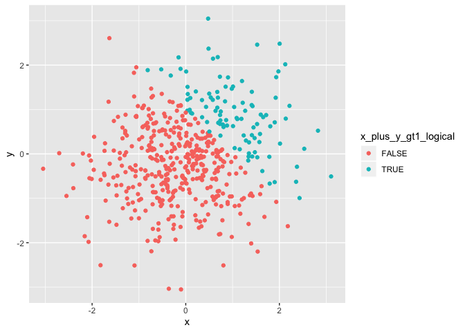
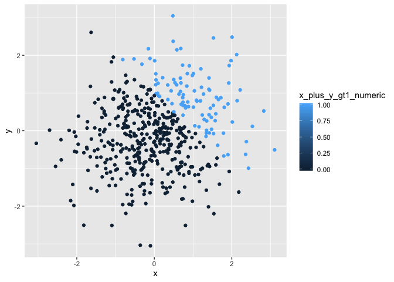
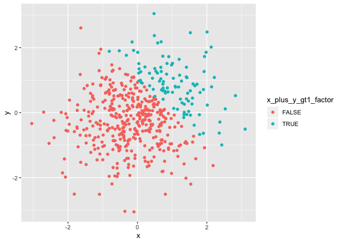

P8105 Homework 1
================
Jessica Lavery
9/15/2019

# Problem 1

``` r
df <- tibble(
  norm_samp = rnorm(8),
  sample_ge0 = norm_samp >= 0, 
  character_vector = c("one", "two", "three", "four", "five", "six", "seven", "eight"),
  factor_vector = factor(x = c("a", "b", "c", "a", "a", "b", "c", "c"), levels = c("a", "b", "c"))
)

#try to take the mean of each variable
mean(pull(df, norm_samp))
```

    ## [1] -0.4520197

``` r
mean(pull(df, sample_ge0))
```

    ## [1] 0.125

``` r
mean(pull(df, character_vector)) #error: argument is not numeric or logical: returning NA[1] NA
```

    ## Warning in mean.default(pull(df, character_vector)): argument is not
    ## numeric or logical: returning NA

    ## [1] NA

``` r
mean(pull(df, factor_vector)) #error: argument is not numeric or logical: returning NA[1] NA
```

    ## Warning in mean.default(pull(df, factor_vector)): argument is not numeric
    ## or logical: returning NA

    ## [1] NA

``` r
mean(pull(df, as.numeric(sample_ge0)))

mean(pull(df, as.numeric(character_vector)))
```

    ## Warning in mean.default(pull(df, as.numeric(character_vector))): argument
    ## is not numeric or logical: returning NA

``` r
mean(pull(df, as.numeric(factor_vector)))
```

    ## Warning in mean.default(pull(df, as.numeric(factor_vector))): argument is
    ## not numeric or logical: returning NA

The logical variable is converted to a numeric variable with 0’s (FALSE)
and 1’s (TRUE), and the mean is able to be computed using the
`as.numeric` function. However, the character and factor variables still
produce an
error.

``` r
#convert the logical vector to numeric and multiply the random sample by the result.
as.numeric(pull(df,sample_ge0)) * pull(df, norm_samp)
```

    ## [1] 0.000000 0.000000 0.000000 1.708322 0.000000 0.000000 0.000000 0.000000

``` r
#convert the logical vector to a factor, and multiply the random sample by the result.
as.factor(pull(df,sample_ge0)) * pull(df, norm_samp)
```

    ## Warning in Ops.factor(as.factor(pull(df, sample_ge0)), pull(df,
    ## norm_samp)): '*' not meaningful for factors

    ## [1] NA NA NA NA NA NA NA NA

``` r
#convert the logical vector to a factor and then convert the result to numeric, and multiply the random sample by the result
as.numeric(as.factor(pull(df,sample_ge0))) * pull(df, norm_samp)
```

    ## [1] -0.6744558 -0.5085175 -0.1100215  3.4166435 -1.6252646 -0.2970513
    ## [7] -1.7697727 -0.3393957

# Problem 2

``` r
df2 <- tibble(
  x = rnorm(500),
  y = rnorm(500),
  x_plus_y_gt1_logical = (x + y > 1),
  x_plus_y_gt1_numeric = as.numeric(x_plus_y_gt1_logical),
  x_plus_y_gt1_factor = as.factor(x_plus_y_gt1_logical)
)
```

The dataset includes 5 variables with 500 observations. Variable x has
mean -0.0180463 and standard deviation 1.020423. From the random
samples, 25.8% of instances have x + y \> 1.

``` r
ggplot(data = df2, aes(x = x, y = y, color = x_plus_y_gt1_logical)) +
  geom_point()
```

<!-- -->

``` r
#export to project directory
ggsave(filename = "hw1_figure1_logical_color_scale.png")
```

    ## Saving 7 x 5 in image

``` r
ggplot(data = df2, aes(x = x, y = y, color = x_plus_y_gt1_numeric)) +
  geom_point()
```

<!-- -->

Using a numeric variable to indicate the color of the scatterplot
results in a color gradient spanning the range of the variable, despite
the fact that there are no instances of the variable having a value
between 0 and 1.

``` r
ggplot(data = df2, aes(x = x, y = y, color = x_plus_y_gt1_factor)) +
  geom_point()
```

<!-- -->

Using a factor variable to determine the color of the points on the
scatterplot is similar to using the logical variable to indicate the
color.
